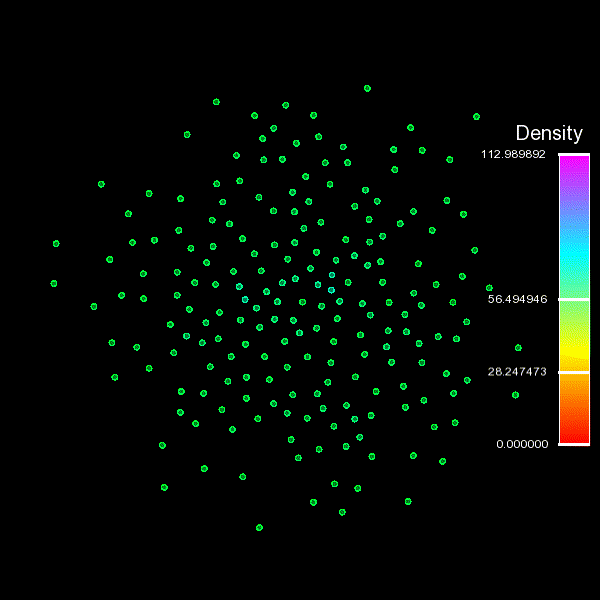

# Моделирование процесса образования звезды методом SPH

**[Ссылка](https://vk.com/away.php?to=https%3A%2F%2Fwww.youtube.com%2Fwatch%3Fv%3Dbs45NErLxuA&cc_key=)** на видео с **лучшим** описанием и **подробнейшей** инструкцией по сборке

## Как собрать проект?

1. сборка происходит с помощью утилиты cmake, так что cmake должен быть установлен :>
2. в терминале переходим в папку (пишем `cd <путь к папке>`), в которой хотим оставить проект.
3. пишем: `git clone git@github.com:Shulliikkk/sph-toy-star.git`
4. `cd sph-toy-star`
5. `cmake -S. -B build` -- эта команда запустит cmake и скажет ему, где расположен сам проект и в какой папке его собирать
6. `cmake --build build` -- собираем проект
7. `build/SPH-STAR` -- запуск программы ("SPH-STAR" -- всего лишь исполняемый файл)

## Что тут вообще происходит?
### Общее описание SPH  
Метод SPH основан на разбиении сплошной среды на дискретный набор частичек, каждая из которых имеет массу $m$ (или другую физическую величину, характеризующую её) и длину сглаживания $h$ - расстояние на котором частичка "размазана" в пространстве или если говорить умными словами - "сглажена" функций ядра. Такой подход позволяет выразить любую физичесую величину любой частицы как сумму соответсвующих величин всех частиц, находящихся на не слишком большом расстоянии от рассматриваемой частицы (если быть чуть более точным, то на расстоянии двух длин сглаживания $2h$). Так, например, плотность в точке пространства завист от плотности всех частиц на расстоянии $2h$.

 Таким образом, влияние всех частиц на свойства другой частицы оценивается в соответствии с плотностью в точках пространства, где они находятся, и расстоянием до интересующей частицы. Математически это описывается функцией ядра $W(|r|, h)$. В нашей работе это функция Гаусса (функция нормального распределния). Она близка к нулю для частиц находящихся дальше, чем две сглаженные длины, т.е. что нам и нужно:)

 !!!Disclaimer: дальше пойдут формулки, всем слабонервным отойти от экрана O_O

 Значение любой физической величины $A$ в точке пространства $\textbf{r}$ задается формулой:

 $$A(**r**) = \sum_j m_j \frac{A_j}{\rho_j}  W(|**r** - **r_j**|, h)$$

 Так, например, плотность пространства в точке нахождения частицы $i$, может быть выражена как:

 $$\rho_i = \sum_j m_j \frac{\rho_j}{\rho_j} W(|**r** - **r_j**|, h) = \sum_j m_j W(|**r** - **r_j**|, h)$$

 Это очень важная формулка, она нам пригодится в дальнейшем.

 ### Описание модели звезды
 Вернемся к нашему проекту. Пусть газо-пылевое облако (будущая звезда) состоит из $N$ частичек, каждая из которых имеет массу $m$, позицию $r_i = (x_i, y_i)$ и скорость $v_i = (v_{xi}, v_{yi}\)$ и подчинятеся уравнению Эйлера для течения идеальной жидкости:

 $$\frac{dv}{dt} = -\frac{1}{\rho} \nabla p + \frac{1}{\rho} f$$

 где $p$ - давление среды, $f$ - внешние силы, приложенные к системе

Свяжем плотность среды и давление через уравнение политропы:

$$p = k \rho^{1 + 1/n}$$

А таже представим внешние силы как сумму гравитационной и вязкостной состовляющий (она вводится для того, чтобы рассчет мог прийти к устойчивому решению):

$$f = -\lambda r - \nu v$$

Более подробно о данной модели звезды можно почитать в статье **[Монагана-Прайса(2004)](https://articles.adsabs.harvard.edu/pdf/2004MNRAS.350.1449M)**.

### Описание методов расчета

Как уже говорилось ранее, в работе используется ядро на основе функции Гаусса, оно выглядит следующим устрашающим образом:

$$W(r, h) = \frac{1}{h^3 \pi^{3/2}} \exp{\frac{-|r|^2}{h^2}}$$

Также нам понадбится его производная:

$$\nabla W = \frac{-2}{h^5 \pi^{3/2}} \exp{\frac{-|r|^2}{h^2}}r$$

Формулку для плотность пространства, в точке нахождения i-й частички мы уже с вами получили, вспомним её и улыбнемся, она имеет более простой вид:

 $$\rho_i = \sum_j m_j W(|**r** - **r_j**|, h)$$

Теперь запишем сердце нашего расчета, дискретизированное уравнение Эйлера, позволяющее вычислить движение всех частичек:

$$ \frac{dv_i}{dt} = -\sum_{i, j \neq i} m_i (\frac{p_i}{\rho_i^2} + \frac{p_j}{\rho_j^2}) \nabla W(r_i - r_j, h) + f$$

Осталась самая малость - численно проинтегрировать его, сделаем это методом Эйлера:

$$r_{i + 1} = r_i + v_i \Delta t$$

$$v_{i + 1} = v_i + a_i \Delta t$$
